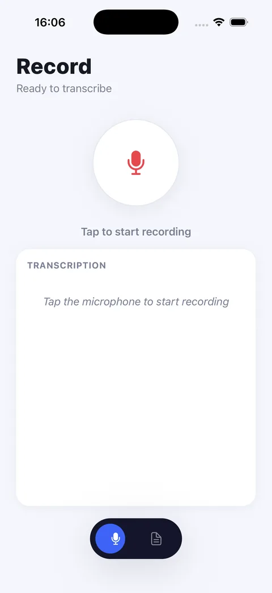
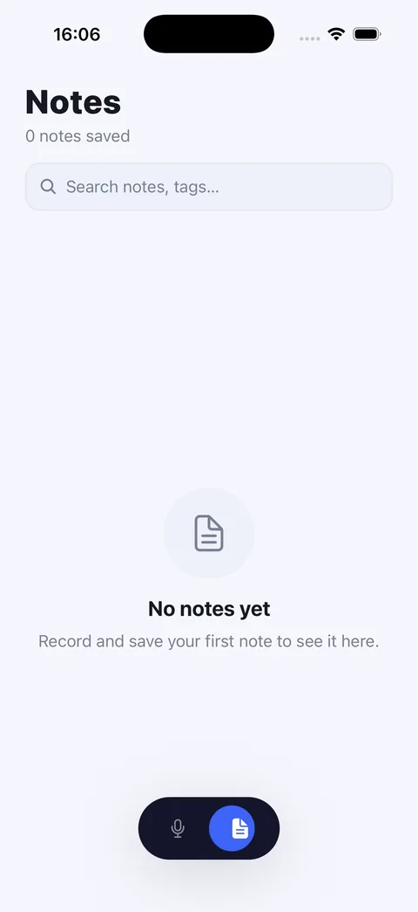
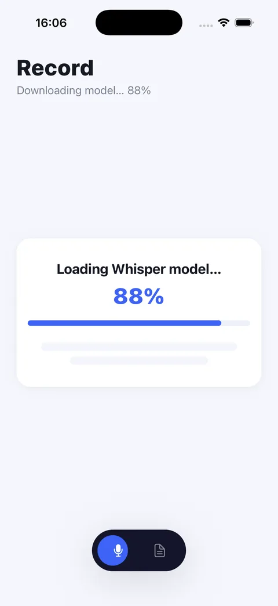

# Audio Transcription App

An Expo / React Native app that records speech and transcribes it **on-device** in real time using OpenAI's Whisper (Base, English) via [`react-native-executorch`](https://github.com/software-mansion/react-native-executorch). No audio ever leaves the phone.

## Screenshots

| Record | Notes | First launch |
|:---:|:---:|:---:|
|  |  |  |
| Tap to record — live transcript below | Search notes by title, text, or tag | Models download once, then cached |

## Features

- **Live streaming transcription** — audio is captured in 100 ms chunks and streamed straight into the Whisper model as you speak, with committed and in-progress (interim) text shown separately. The transcript auto-scrolls as text arrives, unless you've scrolled up to read back.
- **Voice-activity gating** — an FSMN VAD model commits text once it detects ~300 ms of silence, rather than continuously re-transcribing a growing buffer. This is what keeps commit latency down.
- **On-device inference** — runs fully offline through ExecuTorch; no server, no API keys, no network calls.
- **Notes** — recordings are saved as editable notes: title, transcript, and freeform tags, all editable after the fact. Pin the ones you want to keep at the top.
- **Audio playback** — the raw PCM is streamed to a real WAV file on disk while you record, so every note keeps its actual audio for playback.
- **Long recordings** — because audio goes straight to disk instead of accumulating in memory, recording length is bounded by free space rather than the JS heap. The cap is currently 1 hour (~115 MB of WAV), and it's a runaway guard, not a technical limit.
- **Search** — filter notes by title, transcript text, or tag.
- **Export & share** — export any note as `.txt`, `.json`, or `.srt` and share it through the native share sheet.
- **Haptic feedback** on start/stop/save for a more tactile recording experience.

## Requirements

This app **must run on a physical iOS or Android device** — simulators/emulators aren't supported.

| | |
|---|---|
| Node.js | 18+ |
| iOS | Physical device, iOS 17+ |
| Android | Physical device, Android 7.0+ (API 24), **arm64-v8a required** |
| Free storage | ~600 MB (models are downloaded at runtime, not bundled) |
| Expo CLI | via `npx expo` (no global install needed) |

> **arm64-v8a is not optional on Android.** ExecuTorch ships its runtime for 64-bit ARM only — `libexecutorch.so` is absent from the `armeabi-v7a`, `x86`, and `x86_64` slices. On a 32-bit device the app installs and opens but transcription can never become ready (the library reports `isAvailable === false`).

On-device model inference (`react-native-executorch`) and real-time audio capture (`react-native-audio-api`) both need native hardware, so this is a [dev client](https://docs.expo.dev/develop/development-builds/introduction/) build, not Expo Go.

## Getting Started

```bash
git clone https://github.com/mdhamed238/audio-transcription-app.git
cd audio-transcription-app
npm install

# build & run a development client on a connected device
npm run ios      # iOS device
npm run android   # Android device
```

On first launch the models download and initialize — Whisper Base EN is ~380 MB and the VAD ~2 MB, so give it a minute on a slow connection. This happens once; they're cached on disk afterwards.

## How It Works

1. `AudioRecorder` (`react-native-audio-api`) captures 16kHz mono audio and streams 100ms buffers as they're recorded.
2. Each buffer is pushed into the model via `useSpeechToText().streamInsert()` — no need to wait for the recording to finish.
3. The same buffer is appended to a WAV file on disk (`services/wavEncoder.ts`) and reduced to an RMS level that drives the on-screen waveform.
4. `model.stream({ useVAD: true })` yields `{ committed, nonCommitted }` as it decodes; the screen accumulates the committed text and renders the non-committed tail in grey.
5. On stop, the WAV's 44-byte header is patched with the final length — there's no encode pass, so stopping is instant regardless of recording length.
6. The Notes tab lists saved notes; tap one to edit its title/transcript/tags, play back the audio, export, or delete it.

## Project Structure

```
app/
├── _layout.tsx              # Root stack, font loading, initExecutorch() setup
├── note/[id].tsx             # Note Detail modal — edit, tags, pin, playback, export, delete
└── (tabs)/
    ├── _layout.tsx           # Tab navigator (Record / Notes)
    ├── index.tsx             # Record screen — capture + live transcription
    └── notes.tsx              # Notes screen — search, pinned section, cards

components/ui/               # Button, Card, Chip, TextField, EmptyState, Skeleton, …

services/
├── storageService.ts        # AsyncStorage persistence, export (txt/json/srt), sharing
└── wavEncoder.ts              # Streaming WAV writer — appends PCM to disk as it records

constants/
├── config.ts                 # Audio, storage, and export configuration
├── Colors.ts                  # Light/dark theme tokens
└── Spacing.ts                 # Shared spacing/font-size scale

types/
└── index.ts                  # Shared TypeScript types
```

## Tech Stack

- [Expo SDK 54](https://expo.dev) / React Native 0.81 / React 19
- [expo-router](https://docs.expo.dev/router/introduction/) for file-based navigation
- [`react-native-executorch`](https://github.com/software-mansion/react-native-executorch) — on-device Whisper Base (EN) inference + FSMN voice-activity detection
- [`react-native-audio-api`](https://github.com/software-mansion/react-native-audio-api) — low-level streaming audio capture
- [`expo-audio`](https://docs.expo.dev/versions/latest/sdk/audio/) — note playback
- TypeScript, `@react-native-async-storage/async-storage`, `expo-sharing`, `expo-haptics`

## Building

Native builds are managed with [EAS](https://docs.expo.dev/eas/) via the included `Makefile`:

```bash
make preview-ios       # preview build, iOS
make dev-android       # development build, Android
make build MODE=production PLATFORM=all
```

## Known Limitations

- **English only** — uses the fixed Whisper Base EN model. Multilingual (EN/FR/AR) was implemented against `whisper_base()` and reverted: it throws `[Whisper] The 'decode' method did not succeed` on device. Neither a corrupt download nor a tokenizer gap explains it — cause still unknown. See the comment above the `useSpeechToText` call in `app/(tabs)/index.tsx` for how to re-enable it.
- **CPU-only inference on Android** — Whisper runs through XNNPACK. No NPU or GPU backend exists for it at `react-native-executorch` 0.9.3, so speed tracks CPU single-thread performance.
- **Models are never evicted** — the resource fetcher caches by URL with no cleanup, so switching models leaves the old weights on disk permanently.
- **32-bit Android is unsupported** — and the app currently shows an indefinite loading state there rather than explaining why.
- **Device-only** — no simulator/emulator or web fallback for recording/transcription.
- **No automated tests configured** — no test runner is wired up in `package.json` yet.

## Status

Core loop — record, transcribe live, save, review, export — is implemented and working end to end on-device. Treat this as an actively-developed personal project rather than a polished release: expect rough edges around error states and no CI yet.

## License

No license file yet — all rights reserved by default until one is added.
