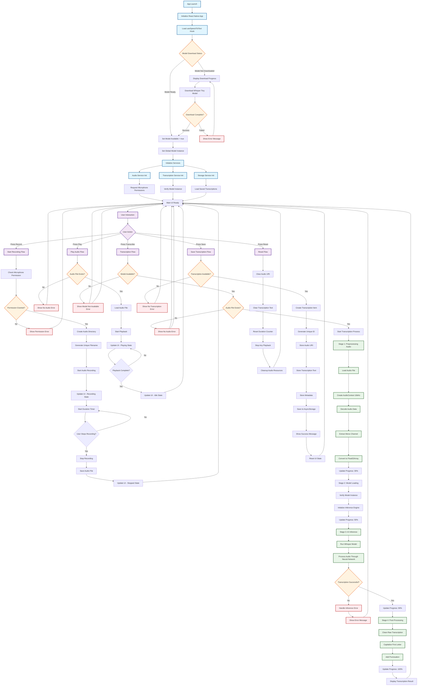
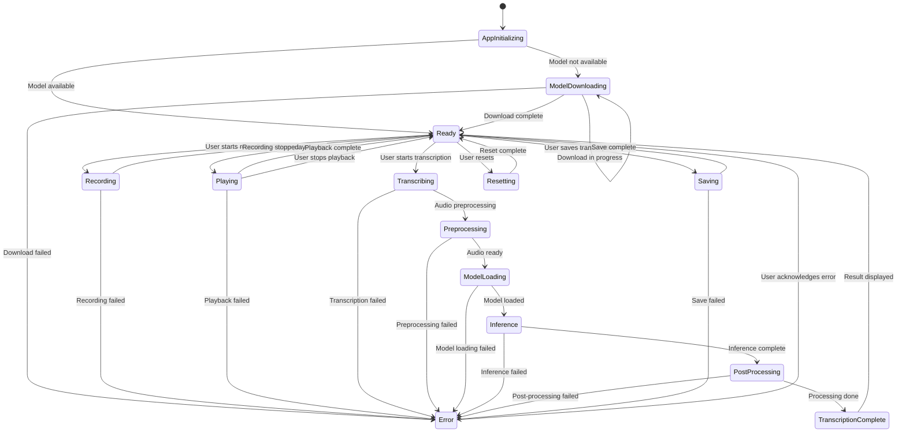
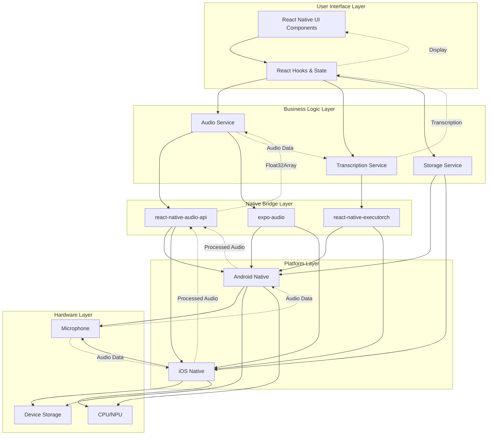
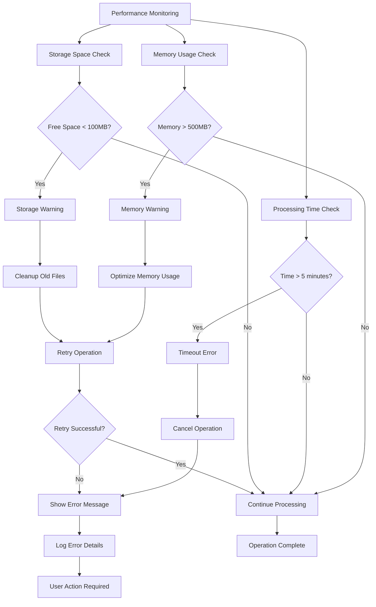

# Audio Transcription App - Workflow Diagram

This document contains a comprehensive mermaid workflow diagram that illustrates the complete flow of the audio transcription application from initialization to transcription completion.

## Application Workflow



## Component Interaction Diagram

```mermaid
graph LR
    subgraph "React Native App"
        A[index.tsx]
        B[useSpeechToText Hook]
    end
    
    subgraph "Services Layer"
        C[audioService.ts]
        D[transcriptionService.ts]
        E[storageService.ts]
        F[modelManager.ts]
    end
    
    subgraph "External Libraries"
        G[react-native-executorch]
        H[react-native-audio-api]
        I[expo-audio]
        J[@react-native-async-storage]
    end
    
    subgraph "Native Modules"
        K[Android Audio HAL]
        L[iOS Audio Session]
        M[Hardware Microphone]
    end
    
    subgraph "AI Model"
        N[Whisper Tiny Model]
        O[ExecuTorch Runtime]
    end
    
    A --> C
    A --> D
    A --> E
    A --> B
    
    B --> G
    B --> N
    G --> O
    
    C --> H
    C --> I
    D --> G
    E --> J
    
    H --> K
    H --> L
    I --> K
    I --> L
    
    K --> M
    L --> M
    
    %% Data Flow
    A -.->|"Audio URI"| C
    C -.->|"Float32Array"| D
    D -.->|"Transcription"| A
    A -.->|"Save Data"| E
    E -.->|"Retrieved Data"| A
    
    classDef uiClass fill:#e3f2fd,stroke:#0277bd,stroke-width:2px
    classDef serviceClass fill:#f1f8e9,stroke:#388e3c,stroke-width:2px
    classDef libClass fill:#fce4ec,stroke:#c2185b,stroke-width:2px
    classDef nativeClass fill:#fff8e1,stroke:#f57c00,stroke-width:2px
    classDef aiClass fill:#f3e5f5,stroke:#7b1fa2,stroke-width:2px
    
    class A,B uiClass
    class C,D,E,F serviceClass
    class G,H,I,J libClass
    class K,L,M nativeClass
    class N,O aiClass
```

## State Management Flow



## Data Flow Architecture



## Performance and Error Handling



## Key Features Highlighted in Workflow

### 1. **Model Management**
- Automatic download of Whisper Tiny model on first launch
- Progress tracking during download
- Model readiness verification before transcription

### 2. **Audio Processing Pipeline**
- 16kHz mono WAV format optimization for Whisper
- Real-time audio recording with duration tracking
- Audio preprocessing using react-native-audio-api
- Format conversion to Float32Array for AI model

### 3. **AI Transcription Process**
- On-device processing using react-native-executorch
- Staged progress reporting (preprocessing, loading, inference, decoding)
- Error handling at each stage
- Post-processing for better readability

### 4. **State Management**
- Comprehensive state tracking for recording, playback, and transcription
- Global model instance management
- Cleanup and resource management

### 5. **User Experience**
- Haptic feedback for user interactions
- Real-time progress updates
- Clear error messages and recovery paths
- Auto-save functionality

### 6. **Data Persistence**
- AsyncStorage for transcriptions and settings
- File system management for audio files
- Export capabilities for transcriptions

This workflow diagram provides a complete overview of how the audio transcription app functions, from user interaction to AI processing and data persistence.
